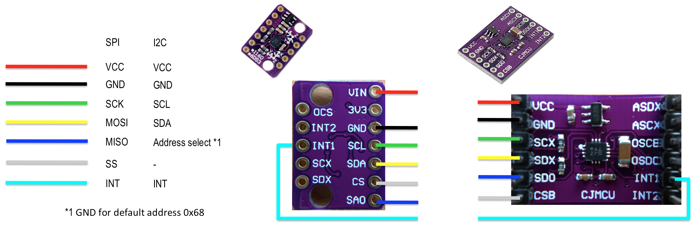

BMI160 6-Axis Fusion
##########################

.. contents::
   :local:
   :depth: 2

This code uses BoschSensortech's BMI160 or BMX160 sensors to calculate quaternion vectors 
It uses accelerometer and gyroscope data to calculate roll and pitch angles

Requirements
************

* nRF52832 Sparkfun Board
* Segger J-Link Edu-Mini
* BoschSensortech BMI160 or BMX160
* Power Source

Overview
********
The orientation is calculated as a quaternion that rotates the gravity vector from earth frame to sensor frame. The gravity vector in the sensor frame is the accelerometer readings and the gravity vector in earth frame is (0,0,-1).
The accelerometer values are sensitive to vibrations. The gyroscope is used to keep track of the gravity vector and correct the accelerometer readings.

Building and running
********************

This is the wiring diagram for BMI160 sensor varieties on the market either SPI or I2C communications.
I had the left one in my local distributors.

Pins of the SPI_0 port on nRF52832 are configured in device tree  ``boards\arm\pedal_board\pedal_board.dt``

Here is the connection table,

+--------------+------------+
|    BMI160    | nRF52832   | 
|              |            |
+==============+============+
| Green(SCK)   |  Pin 12    |
+--------------+------------+
| Yellow(MOSI) |  Pin 13    |
+--------------+------------+
| Blue(MISO)   |  Pin 14    |
+--------------+------------+
| Gray(SS)     |  Pin 11    |
+--------------+------------+

I have connected all on a breadboard for ease of development.

.. image:: testing/myDevBoard.jpg
   :width: 400

Testing
=======

For testing I have build a rotating wheel with adjustable rotational speed. The firmware for the test jig can be found at ``testing\testingWheelFW``

.. image:: testing/testJig.jpg
   :width: 800

Reference/Credits/Sources
*************************

[Beautiful maths simplification: quaternion from two vectors](http://lolengine.net/blog/2013/09/18/beautiful-maths-quaternion-from-vectors)

[Keeping a Good Attitude: A Quaternion-Based Orientation Filter for IMUs and MARGs](https://www.mdpi.com/1424-8220/15/8/19302)

[Phillip's Technology Corner - Fast Quaternion Integration for Attitude Estimation](https://philstech.blogspot.com/2014/09/fast-quaternion-integration-for.html)

[Pizer’s Weblog - Fast Inverse Square Root](https://pizer.wordpress.com/2008/10/12/fast-inverse-square-root/)

[Processing Code](https://www.arduino.cc/en/Tutorial/Genuino101CurieIMUOrientationVisualiser)

