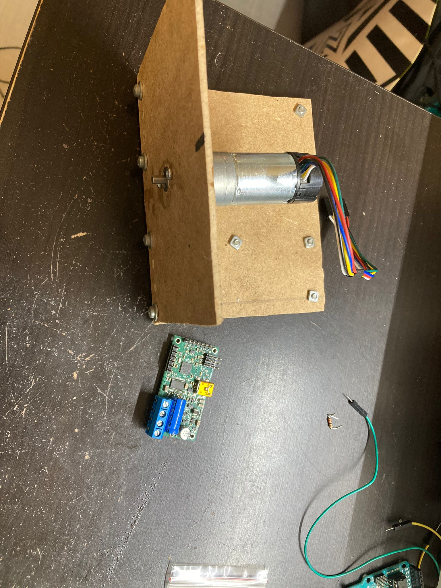
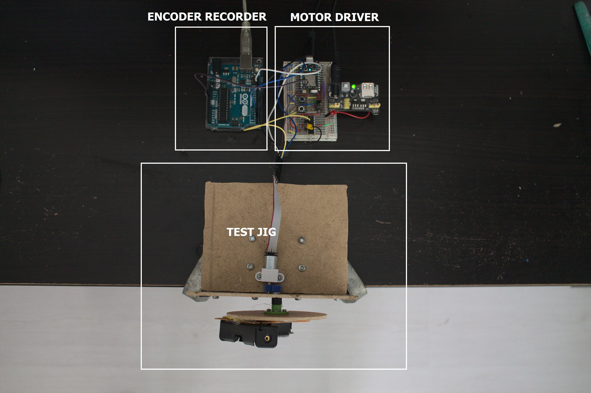
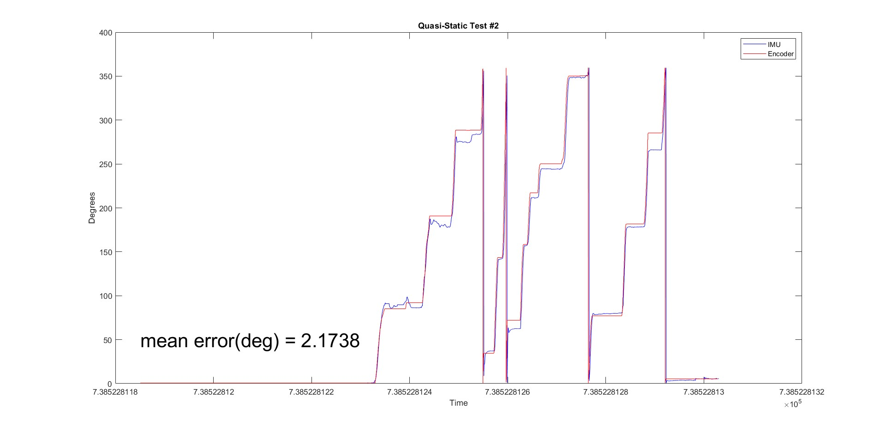
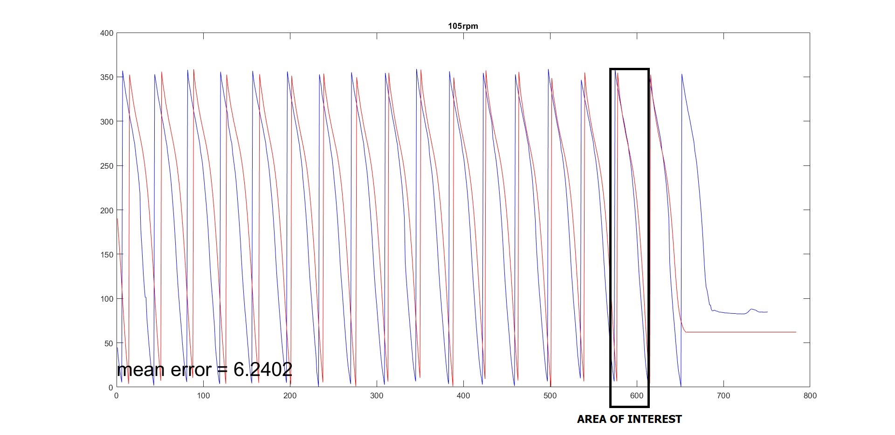
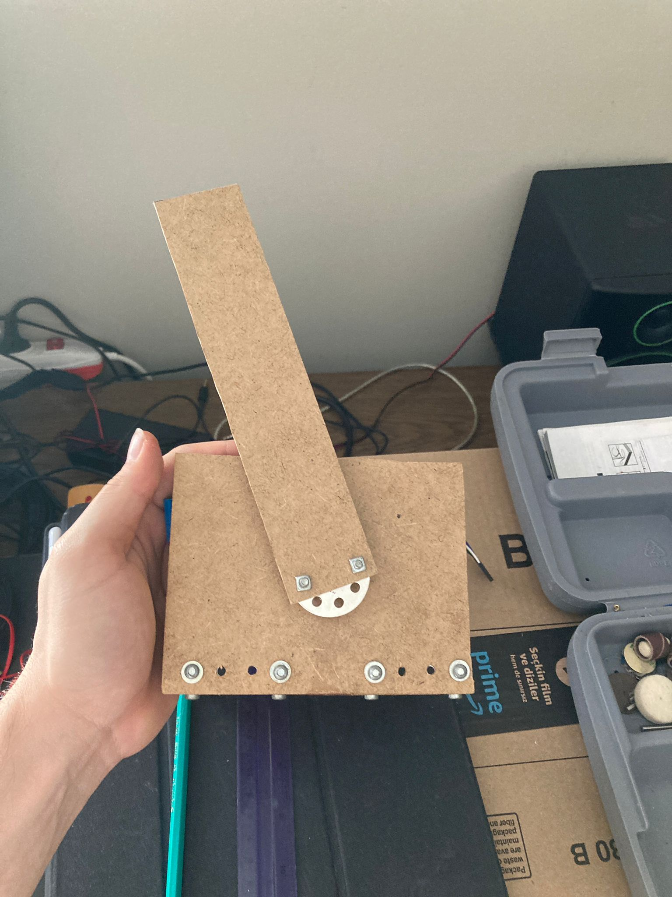
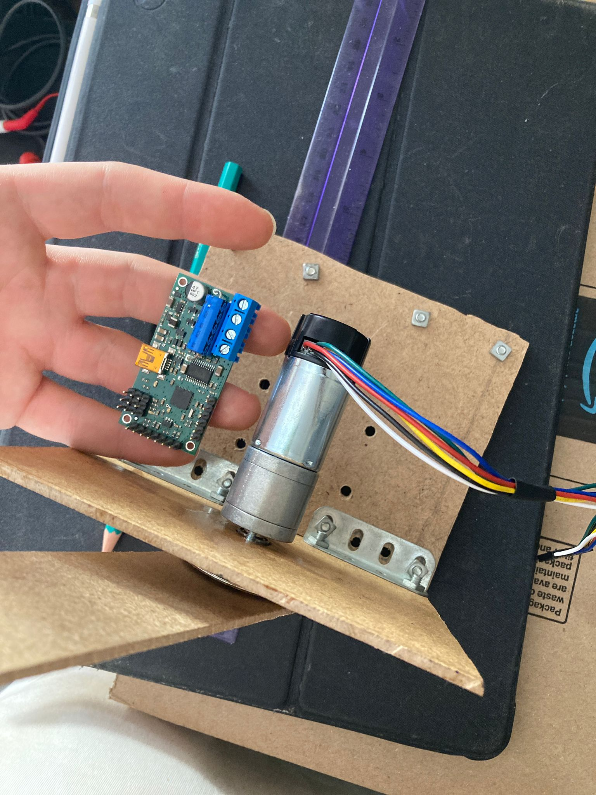
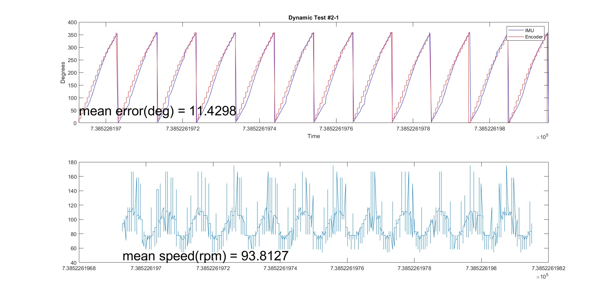
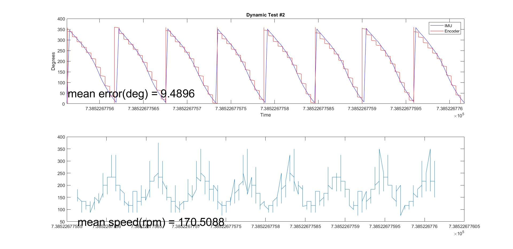

BMI160 6-Axis Fusion
##########################

.. contents::
   :local:
   :depth: 2

This code uses BoschSensortech's BMI160 or BMX160 sensors to calculate quaternion vectors 
It uses accelerometer and gyroscope data to calculate roll and pitch angles

Requirements
************

* nRF52832 Sparkfun Board
* Segger J-Link Edu-Mini
* BoschSensortech BMI160 or BMX160
* Power Source

Overview
********
The orientation is calculated as a quaternion that rotates the gravity vector from earth frame to sensor frame. The gravity vector in the sensor frame is the accelerometer readings and the gravity vector in earth frame is (0,0,-1).
The accelerometer values are sensitive to vibrations. The gyroscope is used to keep track of the gravity vector and correct the accelerometer readings.

Algorithm
*********

The PDF and Mathcad 15 file can be found at ``algorithm\``

.. image:: /algorithm/algorithmPapyrus_Page_1.jpg
   :width: 800

.. image:: /algorithm/algorithmPapyrus_Page_2.jpg
   :width: 800
   
.. image:: /algorithm/algorithmPapyrus_Page_3.jpg
   :width: 800

.. image:: /algorithm/algorithmPapyrus_Page_4.jpg
   :width: 800

.. image:: /algorithm/algorithmPapyrus_Page_5.jpg
   :width: 800

Building and running
********************

This is the wiring diagram for BMI160 sensor varieties on the market either SPI or I2C communications.
I had the left one in my local distributors.

.. image:: testing/BMI160.png
   :width: 800

Pins of the SPI_0 port on nRF52832 are configured in device tree  ``boards\arm\pedal_board\pedal_board.dt``

Here is the connection table,

+--------------+------------+
|    BMI160    | nRF52832   | 
|              |            |
+==============+============+
| Green(SCK)   |  Pin 12    |
+--------------+------------+
| Yellow(MOSI) |  Pin 13    |
+--------------+------------+
| Blue(MISO)   |  Pin 14    |
+--------------+------------+
| Gray(SS)     |  Pin 11    |
+--------------+------------+

I have connected all on a breadboard for ease of development.

.. image:: testing/myDevBoard.jpg
   :width: 400

Testing
=======

For testing I have build a rotating wheel with adjustable rotational speed. The firmware for the test jig can be found at ``\testing\test_FW``

.. image:: testing/testJig.jpg
   :width: 800

In addition there needed to be a battery powered device where the IMU data can be logged.

.. image:: testing/imuLogger.jpg
   :width: 800

For bedding of the shaft of the rotating wheel SKF 623-2Z bearing is used.

Encoder Motor Specifications,

+--------------+------------+
|     Spec     |    Value   | 
|              |            |
+==============+============+
| Speed        |  330RPM    |
+--------------+------------+
| Voltage      |    12V     |
+--------------+------------+
| Gear Ratio   |   75:1     |
+--------------+------------+
| PPM          |     12     |
+--------------+------------+
| Precision    |   0.3deg   |
+--------------+------------+

Then the dynamic tests revealed that the required torque and the encoder resolution is higher than the presented motor - encoder assembly above.
Instead of a micrometal motor the test setup is upgraded to 25D Pololu gearmotors and Pololu Simple motor controller.

https://www.pololu.com/product/4846

https://www.pololu.com/product/1373

+--------------+------------+
|     Spec     |    Value   | 
|              |            |
+==============+============+
| Speed        |  130RPM    |
+--------------+------------+
| Voltage      |    12V     |
+--------------+------------+
| Gear Ratio   |   75:1     |
+--------------+------------+
| PPM          |     48     |
+--------------+------------+

Test Setup - 1
----------------

.. image:: testing/testPrep1.jpg
   :width: 800

The data is collected and processed through Matlab software. The datasets and the matlab software can be fount at ``\testing\matlabSignalSync``

The challenges of the prepared testing setup is

- High backlash of gearmotor and gears (Reduces precision)
- Low motor torque (Constant angular velocity cannot be achieved)
- Asynchronus data collection (Reduces the dataset quality)
- Low encoder resolution 

Test Results - 1
------------------

There is two tests conducted with the opposed setup, 

#. Quasi-static, where wheel rotation is done manually.
#. Dynamic, where wheel rotated at a constant speed.

   

Test Setup - 2
----------------

The data is collected and processed through Matlab software. The datasets and the matlab software can be fount at ``\testing\matlabSignalSync``
The firmware is now updated with NTP codes for synchronization. The test jig connects to internet via Wi-Fi to timestamp collected data. The firmware for NTP can be found  ``\testing\test_FW\NTP_fw``

Also the motor, encoder and motor driver is upgraded to achieve higher precision and stability in dynamic testing. In addition a 17cm pedal like part is used to simulate a bicycle pedal.

   

The challenges of the prepared testing setup is

- High backlash of gearmotor and gears (Reduces precision)
- Low encoder resolution (Top precision should be deployed PPR > 512 )

Test Results - 2
------------------

There is two tests conducted with the opposed setup, 

#. Dynamic, where wheel rotated at a constant speed, at 93RPM
#. Dynamic, where wheel rotated at a constant speed, at 170RPM

   

Reference/Credits/Sources
*************************

[Beautiful maths simplification: quaternion from two vectors](http://lolengine.net/blog/2013/09/18/beautiful-maths-quaternion-from-vectors)

[Keeping a Good Attitude: A Quaternion-Based Orientation Filter for IMUs and MARGs](https://www.mdpi.com/1424-8220/15/8/19302)

[Phillip's Technology Corner - Fast Quaternion Integration for Attitude Estimation](https://philstech.blogspot.com/2014/09/fast-quaternion-integration-for.html)

[Pizer’s Weblog - Fast Inverse Square Root](https://pizer.wordpress.com/2008/10/12/fast-inverse-square-root/)

[Processing Code](https://www.arduino.cc/en/Tutorial/Genuino101CurieIMUOrientationVisualiser)

